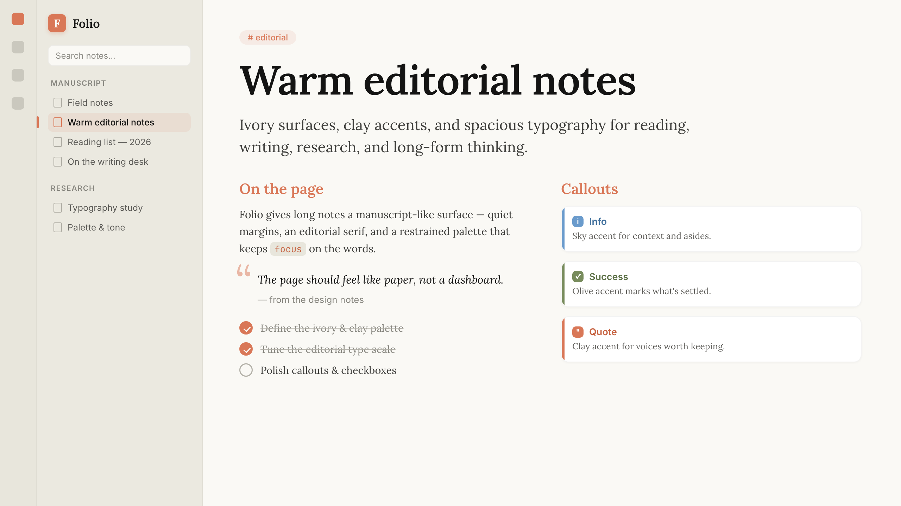
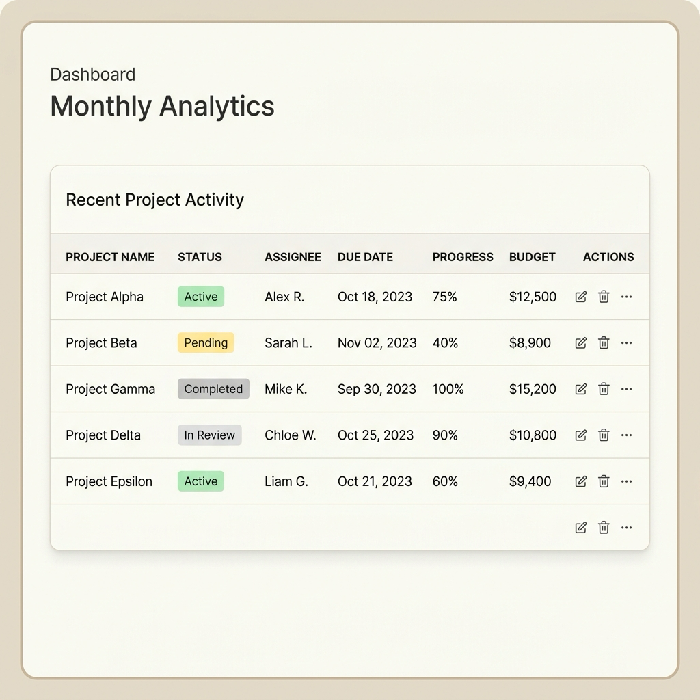
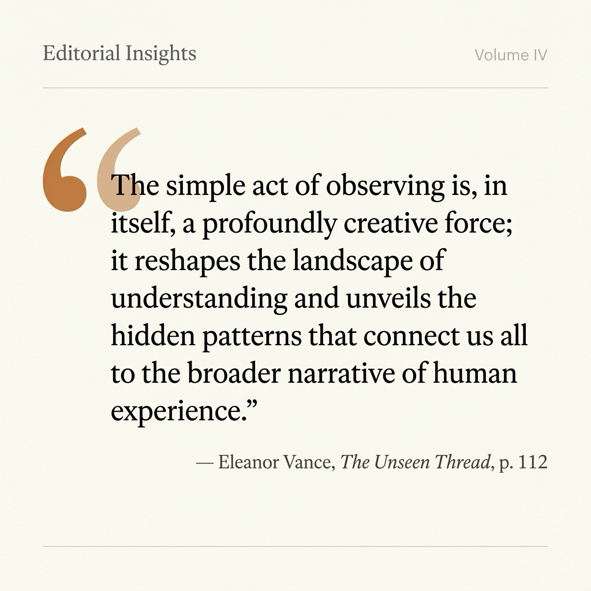

# Folio

[English](README.md)



Folio 是一款为 Obsidian 设计的温暖编辑感主题。它用象牙白背景、陶土色强调、克制的排版和安静的界面细节，让长文档、研究笔记和日常知识工作更像一张可以反复阅读的手稿。

如果你希望 Obsidian 少一点通用软件界面感，多一点平静、耐读、适合书写的工作台气质，Folio 就是为此而做的。

## 亮点

- 统一的亮色与暗色模式，围绕象牙白、页岩灰、炭黑和陶土色构建
- 面向阅读、写作、研究笔记和长文思考的编辑感排版
- 适合中英文混排的字体回退栈
- 为 `info`、`warning`、`error`、`danger`、`success`、`tip`、`question`、`quote`、`abstract`、`summary` 和 `example` 提供多色 callout
- 覆盖标题、表格、引用、链接、标签、复选框、嵌入、代码块、属性、Canvas 节点和文件导航
- 细致调整命令面板、搜索、标签页、菜单、弹窗、滑块、设置界面和移动端界面
- 支持清晰的键盘焦点、减少动态效果、高对比度和适合打印/PDF 的输出

## 预览





## 设计

Folio 使用一套克制的编辑色彩系统：

| 色彩 | 用途 |
| --- | --- |
| 象牙白 | 主要书写背景 |
| 页岩灰 | 正文与标题 |
| 陶土色 | 链接、按钮、选区、焦点和激活状态 |
| 炭黑 | 暗色模式背景 |

排版针对中英文混排进行调整。公开主题使用开源字体与系统字体回退，不包含私有字体文件：

- **阅读与标题：** Lora、Georgia 和 CJK 衬线字体回退
- **界面：** Instrument Sans、Inter 和系统 UI 字体回退
- **代码：** JetBrains Mono 和系统等宽字体回退

## Folio 覆盖了哪些界面

Folio 重点打磨 Obsidian 日常写作中最常接触的部分：

- **Callout：** 为常见笔记状态提供清晰的强调色，但不让页面显得嘈杂
- **表格：** 无边框网格的编辑感表格，带有细微陶土色外框、8px 圆角、加粗表头和轻微背景层次
- **引用块：** 杂志感引用样式，隐藏传统边框，用精致的衬线引号和缩进营造阅读停顿
- **代码：** 为关键字、字符串、数字、注释、函数、类型、属性、运算符和变量提供温暖的语法色
- **导航：** 当前文件和大纲项目使用陶土色强调条，帮助定位上下文
- **属性：** 透明属性字段，并带有克制的悬停与焦点状态
- **Canvas 与嵌入：** 圆角节点、安静边框和柔和层次
- **标签与复选框：** 陶土色胶囊标签和填充式任务复选框
- **可访问性：** 可见键盘焦点、高对比度支持、减少动态效果支持，以及适合打印/PDF 的样式

## 安装

从 Obsidian 社区主题市场安装：

1. 打开 **设置 -> 外观 -> 主题 -> 管理**
2. 搜索 **Folio**
3. 安装并启用主题

也可以手动安装：下载最新 release 中的 `theme.css` 和 `manifest.json`，并放入：

```text
<vault>/.obsidian/themes/Folio/
```

## 兼容性

- Obsidian 1.5.0+
- 支持亮色与暗色模式
- 支持桌面端与移动端
- 不依赖插件

## 许可证

[MIT](LICENSE)
